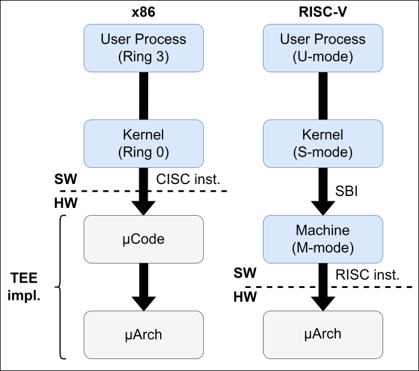
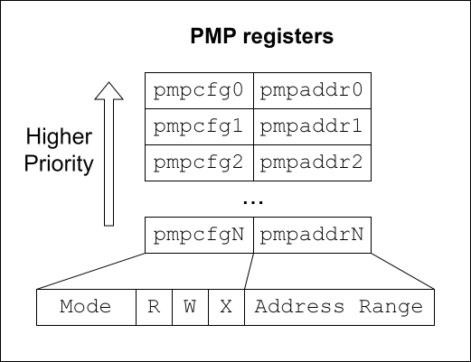
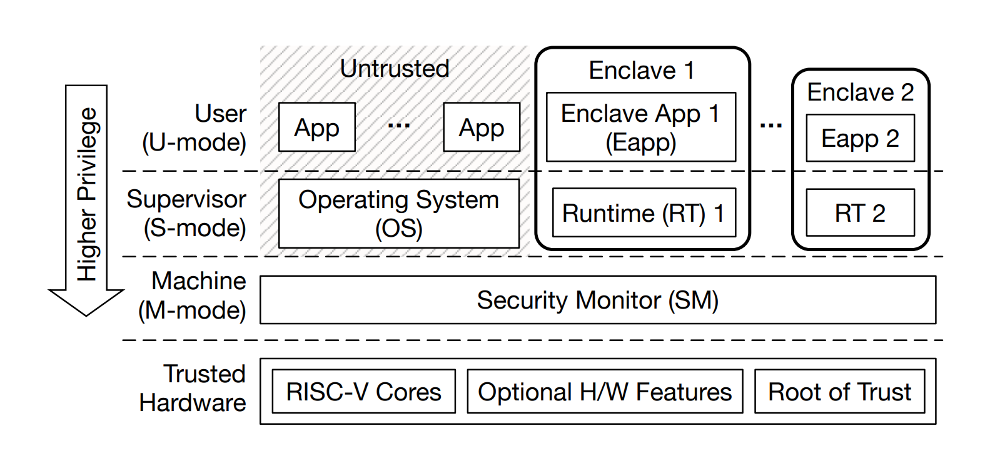
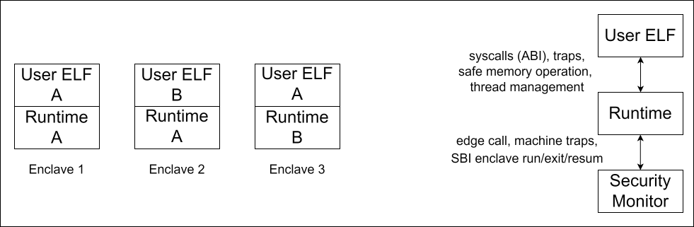
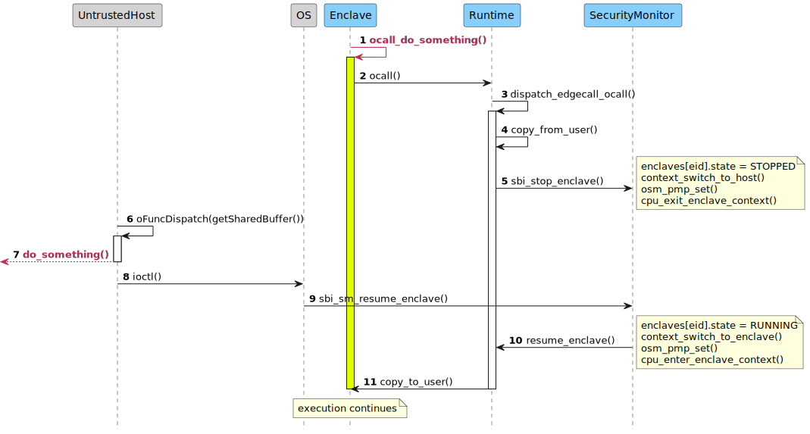

This post outlines the functionalities of the [Keystone Enclave](https://keystone-enclave.org/) framework, extracted from my master's thesis *(updated to December 2022)*. Keystone is an open-source framework designed for building Trusted Execution Environments, adaptable for various platforms that are based on RISC-V hardware.

<!--truncate-->

## Trusted Execution Environment
A **Trusted Execution Environment (TEE)** is an execution environment that runs alongside but is isolated from the device's main operating system.
It ensures that the *confidentiality* and *integrity* of the code and data loaded in the TEE are preserved. 
Trusted applications running on TEE have access to the full capabilities of a device's main processor and memory, while hardware isolation shields these components from user-installed apps running in the main operating system. The various included trusted applications are protected from one another by software and cryptographic isolations within the TEE.\
The two most common TEE implementations at the moment are ARM TrustZone and Intel SGX. All these TEEs make design decisions based on either the target applications or threat models and these choices are fixed since they are strictly hardware related. They were not designed to have flexibility or extensibility for enclave developers. If the hardware changes or has a new feature, the enclave developer has to redesign the TEE.
All TEE platforms aim to reduce the enclave's trusted computing base, and they have managed to achieve different degrees of success. The [Trusted Computing Base (TCB)](https://apps.dtic.mil/sti/pdfs/ADA108831.pdf) is a section of the system, which could include hardware, firmware and software. It is responsible for enforcing the security policy of the system. Additionally, closed-source hardware and microcode implementations make it impossible for a third party to evaluate the security of TEEs.

### Customizable Trusted Execution Environment
[Customizable TEE](https://keystone-enclave.org/2019/07/22/Keystone-Paper.html) is the solution to closed-source hardware-implemented TEEs problems. It has been designed to be flexible, and configurable and to have a small TCB. It has been designed with clear abstractions and a modular programming model which simplifies for others to extend and add features to the TEE. An example of a customizable TEE is Keystone. Three logical actors, such as the manufacturer (who makes the hardware), the platform provider (runs the hardware, such as a cloud provider), and the enclave developer (who writes software that runs in the enclaves), were identified by Keystone developers as being a part of the customizable TEE ecosystem. In a customizable TEE, as opposed to a standard TEE, decisions made by all 3 actors together determine the security guarantees offered and the functionalities enabled.\
Keystone offers security primitives that can be joined together via the software framework rather than creating a single instance of TEE hardware. The TEE can be modified by the creator of the enclave and the platform provider to suit their threat models or platform configurations. The Keystone project offers a general and formally proven interface for a variety of devices to create an open standard for TEEs. 

## RISC-V Background
[RISC-V](https://riscv.org/technical/specifications/) is open-source, which provides Keystone with several benefits. The most noticeable is that anyone can see how it works, understand the threat model it can operate under, and verify how exploits/patches function.\
Other advantages of RISC-V are security-oriented primitives, which provide efficient isolation, the most notable being [Physical Memory Protection (PMP)](https://sifive.github.io/freedom-metal-docs/devguide/pmps.html). RISC-V is an evolving and community-driven Instruction Set Architecture (ISA). Keystone has been designed and developed using RISC-V standard security features. Moreover, the ever-growing world of RISC-V gives Keystone a wide variety of potential platforms and different deployment scenarios to which it can adapt to. 

### RISC-V Privilieged ISA
[RISC-V](https://riscv.org/technical/specifications/) has three software privilege levels (in increasing order of capability): user mode (U-mode), supervisor mode (S-mode), and machine mode (M-mode). Only one of the privilege modes can be active on the processor at once.\
The active privilege level determines what the software can do while it is running. These are typical applications for each level of privilege:
- *U-mode*: user processes 
- *S-mode*: kernel (including kernel modules and device drivers) or hypervisor
- *M-mode*: bootloader and firmware.

When the processor is in the highest privilege mode, M-mode, it is in control of all physical resources and interrupts. As with microcode in Complex Instruction Set Computer (CISC) ISAs (such as x86), M-mode is not interruptible and not affected by the interference of lower modes. M-mode is used in Keystone for executing the TCB of the system, the *security monitor* (SM).

 *Architecture differences between x86 and Keystone*

The following are some advantages of utilizing an M-mode software as the TCB:
- programmability: unlike microcode for x86, in RISC-V M-mode software can be written using pre-existing toolchains and programming languages, such as C 
- agile patching: since the TCB is purely software, bugs or vulnerabilities can be patched without updates, which are specific to a particular hardware 
- verifiability: compared to hardware, the software is generally simpler to be formally verified.

### Physical Memory Protection
[Physical Memory Protection (PMP)](https://sifive.github.io/freedom-metal-docs/devguide/pmps.html) is a strong standard primitive that enables M-mode to control the access to physical memory from lower privileges modes. Keystone requires PMP to implement memory isolation of enclaves.
Only software in M-mode can configure the PMP, which is controlled by a series of control and status registers (CSR) that limit physical memory access to the U-mode and S-mode. Depending on the platform design, PMP entries number can change. 

 *Image representing PMP registers*

Since PMP exclusively works on physical addresses, S-mode can continue to support virtual addresses without affecting the security of the system. Even though each processor may implement PMP differently in hardware, the basic guarantees are part of the standard. PMP is used by Keystone Security Monitor to create memory isolation.


## Keystone components
A Keystone-capable system is made up of different modules operating in various privilege modes as shown in the figure below:

 _Keystone system with host processes, untrusted OS, security monitor, and multiple enclaves (each with runtime and eapp)_

#### Trusted Hardware
Trusted Hardware is a CPU package built by an honest manufacturer that must enclose standard RISC-V cores, which are Keystone compatible, and a root of trust. Optional features of the hardware could also include memory encryption, cache partitioning, a cryptographically safe source of randomness, etc. Platform-specific plug-ins are needed by the Security Monitor to support optional features.

### Security Monitor
**Security Monitor (SM)** is a trusted software that runs in M-mode and works as the small TCB in the Keystone system. Before the SM can be considered trusted, it must be verified by the hardware root of trust. Then, the root of trust *measures* the SM, generates a keypair for remote attestation, signs the public key, and eventually can continue booting. The measurement of the SM consists in computing the hash of the SM firmware image. The SM manages isolation boundaries between the enclaves and the untrusted OS, therefore it implements the majority of Keystone's security guarantees.  It serves as an interface for managing the enclave's lifecycle and utilising platform-specific features. The OS and enclaves may call SM functions using the Supervisor Binary Interface (SBI). Specifically, the SM provides the following functionality:
- *memory isolation* using RISC-V PMP
- *remote attestation* (signatures and measurement): the goal is to demonstrate to a remote client that the enclave contains the expected application, and is running on trusted hardware
- and other features, such as system PMP synchronization, enclave thread management and side-channel defences

### Runtime
Keystone developers implemented the **Runtime (RT)** with the goal of minimal and flexible TCB. It is an S-mode software. As a result, enclave applications can use modular system-level abstraction (e.g., virtual memory management). It provides kernel-like functionality, such as system calls, trap handling, virtual memory management and so on. Although the RT functions similarly to a kernel inside an enclave, most kernel functionalities are not necessary for the enclave application. To allow enclave developers to include only the necessary functionality and minimize the TCB, Keystone developers created an example of RT called Eyrie. It enables reusability since it is compatible with multiple-user programs. And by adding RT modules, they expand RT functionality without changing user applications or without complicating the SM.

 _Example of runtime reusability on the left and its functionalities on the right_

### Enclave
An **Enclave** is an environment isolated from the untrusted OS and other enclaves. Each enclave is provided with a private physical memory region which is accessible by only the enclave and SM. Each enclave consists of a user-level enclave application called *eapp* and a supervisor-level runtime. An eapp is a user-level application that executes in the enclave. A developer can create a custom eapp from scratch, or just execute an existing RISC-V binary in Keystone. The enclave lifecycle is shown below. 

 _Enclave Lifecycle from Keystone docs_

The main phases are:
- *creation*: when an enclave is started it has a contiguous range of physical memory that is called Enclave Private Memory (EPM). In the beginning, the EPM is allocated by the untrusted host, which initialises it with the enclave's page table, the runtime and the enclave application. When the untrusted host calls the SM to create an enclave, the SM isolates and secures the EPM using a PMP entry, and then the PMP status is propagated throughout all of the system's cores. Subsequently, before the enclave execution, the enclave's initial state is measured and verified by the SM.
- *execution*: the SM enters the enclave on one of the cores as soon as the untrusted asks for it. The PMP permission is enabled to the core by the SM, and the core starts running the eapp. The RT can exit or re-enter the enclave at any time depending on the execution flow of the eapp. The PMP permissions are switched to keep the isolation each time a core exits or enters the enclave.
- *destruction*: the untrusted host may want to destroy the enclave at any moment, when it happens, the EPM is cleared by the SM and the PMP entry is freed. The untrusted host then definitely reclaims the released memory.


### Edge Calls
Function calls that enter or exit the enclave are known as *edge calls* in Keystone, as in other enclave systems. For instance, if an enclave wants to send a network packet, it must use an edge call to deliver the data to an untrusted host process. The current version of Keystone allows *enclave* $\rightarrow$ *untrusted host* calls, also known internally as *ocalls* (outbound calls, names under discussion). In the current version of Keystone, all ocall wrapping code uses shared memory regions to transfer data. When referencing data in these regions virtual address pointers are never used, instead, only offsets into the region are used.
 
 _Simplified example of an ocall lifecycle_

#### Edge Calls Lifecycle
Consider for example a generic `ocall_do_something`, as represented in Fig. [ocall-lifecycle]. This call transfers some values passed as arguments from the enclave to be processed by the host process (it could be a value to be printed, a file to be stored and so on). The enclave application calls `ocall_do_something(...)`, which is an edge wrapper function.\
`ocall_do_something(...)` uses the system-call-like interface to the runtime to execute an *ocalls* similar to `ocall(OCALL_DO_SOMETHING, &input, sizeof(input), &ouput,  sizeof(output))`. The enclave passes a pointer to the value, the size of the argument and any necessary return buffer information. 
After allocating an `edge_call` structure in the shared memory region, the runtime fills out the call type, copies the value into another part of the shared memory, and sets up the offset to the argument value. Note that, in Keystone, edge calls employ offset values in the shared memory area, rather than pointers.
The runtime subsequently exits the enclave with an `SBI_CALL`, i.e. `sbi_stop_enclave()`, passing a value indicating that the enclave is executing an *ocalls* rather than shutting down. 

After resuming execution of the Keystone kernel driver, it checks the enclave's exit status, notes a pending *ocalls* and handles control to the userspace host process. 
The registered *ocalls* handler wrapper for `OCALL_DO_SOMETHING` is dispatched by the userspace host process, which also consumes the edge call. The wrapper generates a pointer to the argument value from the offset in the shared memory region and then calls `do_something` with the value as an argument. The host wrapper determines whether any return values must be copied into the shared memory region upon return and returns the control to the driver after setting the edge call return status to `SUCCESS`. 

Through an `SBI_CALL`, the driver rejoins the enclave runtime. The enclave *ocalls* wrapper code is resumed once the runtime determines whether any return information has to be copied from the shared region into return buffers. Finally, the enclave function that has called at the beginning `ocall_do_something` receives any return values from the *ocalls* wrapper code.


## Memory isolation using RISC-V PMP
In Keystone, developers refer to the memory section that an enclave uses as a *region* and each region is defined by a PMP entry. The SM employs two PMP registers for internal purposes (i.e. security monitor memory and untrusted memory). One active enclave may use one of the remaining PMP entries each. RISC-V PMP has several properties, the most relevant are: 
- prioritization by index: the index of PMP entries statically determines the priority. Indices go from `0` to `N`, where `N` depends upon the platform. `0` is the highest priority, whereas `N` is the lowest 
- default denies: if no PMP entry matches with an address, the memory access will be rejected by default.

For simplicity, in the following explanation PMP entries are denoted as `pmp[i]` where `i` is an index. Below is a representation of the memory in its initial state. At the start of the boot process, physical memory is not accessible by U- or S-modes. 

``` title=" Memory state when booting start \label{sm-pmp-1}"
-: inaccessible (NO_PERM), =: accessible (ALL_PERM)

pmp[1:N]    |                                       | : undefined
net result  |---------------------------------------|   
```

The SM sets the highest priority PMP entry to cover the address range containing itself and sets all permission bits to 0. Suddenly, the SM sets the lowest priority PMP entry to cover the full memory and sets all permission bits to 1, this will allow the OS to access the remaining memory and start booting. The result can be seen below.

``` title="Memory state just after booting"
-: inaccessible (NO_PERM), =: accessible (ALL_PERM)

pmp[0]       |-------|                              | : SM memory
pmp[others]  |                                      | : undefined
pmp[N]       |======================================| : OS memory
net result   |-------|==============================|
```

As shown below, every time the SM creates an enclave, it will select a PMP entry for the enclave to defend its memory from other U-/S-mode software.

``` title="Memory accessible by the untrusted host"
-: inaccessible (NO_PERM), =: accessible (ALL_PERM)

pmp[0]       |-------|                              | : SM memory
pmp[1]       |              |---------|             | : enclave 
                                                        memory
pmp[others]  |                                      | : undefined
pmp[N]       |======================================| : OS memory
net result   |-------|======|---------|=============|
```

When the SM enters the enclave and executes the eapp, it flips the permission bits of the enclave's PMP entry and the last PMP entry. Untrusted shared buffer is the term for the contiguous memory region that Keystone enables the OS to allocate in the OS memory space in order to use it as an enclave's communication buffer. This is shown below.\
The SM just flips the permission bits back when it leaves the enclave. When an enclave is destroyed by the SM, the PMP entry is made available for usage by other enclaves.

``` title="Memory accessible by a running enclave"
-: inaccessible (NO_PERM), =: accessible (ALL_PERM)

pmp[0]       |-------|                              | : SM memory
pmp[1]       |              |=========|             | : enclave 
                                                        memory
pmp[others]  |                                      | : undefined
pmp[N]       |                                |==|  | : untrusted 
                                                        shared 
                                                        buffer
net result   |-------|------|=========|-------|==|--|
```

## Keystone key-hierarchy
Below is shown the key hierarchy of Keystone. The root of the key hierarchy is the asymmetric processor key pair (`SK_D` and  `PK_D`). The asymmetric security monitor key pair (`SK_SK` and `PK_SM`) is derived from the measurement of the security monitor (`H_SM`) and the private processor key (`SK_D`).
As a result, the computed security monitor key pair is bound to the processor and to the identity of the security monitor itself.

 _The key hierarchy of Keystone_

### Sealing-Key Derivation
The image above also illustrates how *sealing-keys* are derived. An enclave can generate a key for data encryption using the data-sealing capability, enabling it to store data in untrusted non-volatile memory outside the enclave. This key is tied to the identity of the processor, the security monitor, and the enclave. As a result, only the same enclave using the same processor and security monitor can generate the same key. Data can be encrypted using this key and stored in unsecured, non-volatile memory. After an enclave restart, it can generate the same key once more, retrieve the encrypted data from the untrusted storage, and then use the derived key to decrypt it. A sealing key is computed starting from three inputs:
- the private security monitor key (`SK_SM`)
- the hash of the enclave (`H_SM`)
- a key identifier
The key identifier is an extra input for the key derivation function selectable by the enclave. A single enclave can generate several keys by giving the key identifier various values.

## Resources

- [Trusted Execution Environment: What It is, and What It is Not](https://doi.org/10.1109/Trustcom.2015.357), Sabt, Mohamed and Achemlal, Mohammed and Bouabdallah, Abdelmadjid
- [Introduction to Trusted Execution Environment: ARM's TrustZone](https://blog.quarkslab.com/introduction-to-trusted-execution-environment-arms-trustzone.html)
- [Specification of a trusted computing base (TCB)](https://apps.dtic.mil/sti/pdfs/ADA108831.pdf)
- [Keystone blog](https://keystone-enclave.org/blog/)
- [Keystone Enclave's documentation](https://docs.keystone-enclave.org/en/latest/index.html)
- [Keystone: An open framework for architecting trusted execution environments](https://doi.org/10.1145/3342195.3387532), Lee, Dayeol and Kohlbrenner, David and Shinde, Shweta and Asanovi'c, Krste and Song, Dawn
- [Physical Memory Protection](https://sifive.github.io/freedom-metal-docs/devguide/pmps.html)
- [RISC-V Specification Documentations](https://riscv.org/technical/specifications/)